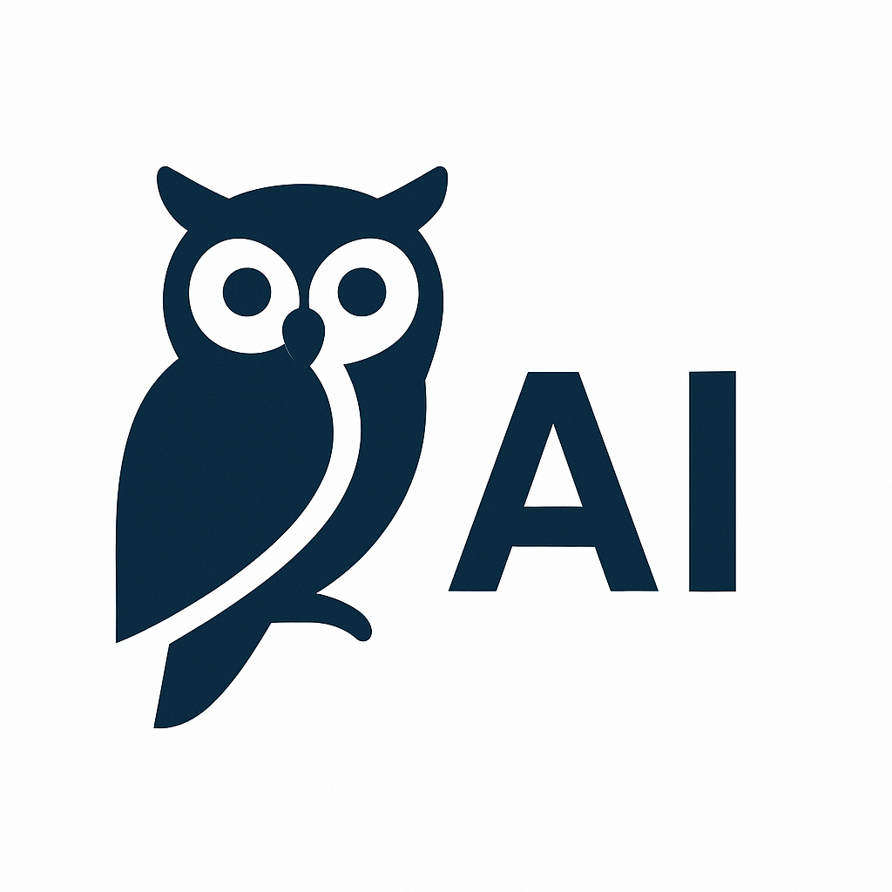

<div class="hero-section">
  <div class="hero-content">
    <div class="logo-container">
      <div class="logo-animation">
        <div class="logo-circle">
          
        </div>
        <div class="sonar-ring sonar-1"></div>
        <div class="sonar-ring sonar-2"></div>
        <div class="sonar-ring sonar-3"></div>
      </div>
    </div>
    
    <h1 class="hero-title">
      <span class="title-gradient"><strong>AiHint</strong></span>
      <span class="title-standard"><strong>Standard</strong></span>
    </h1>
    
    <div class="version-badge">
      <span class="version-text">v1.1.0</span>
    </div>
    
    <p class="hero-subtitle">
      An open standard for <span class="highlight">signed</span>, <span class="highlight">verifiable</span> metadata and <span class="highlight">trust scoring</span> for websites
    </p>
    
    <div class="hero-features">
      <div class="feature-item">
        <span class="feature-icon">🔐</span>
        <span>Cryptographic</br>Signatures</span>
      </div>
      <div class="feature-item">
        <span class="feature-icon">🌐</span>
        <span>Multi-Language</br>Support</span>
      </div>
      <div class="feature-item">
        <span class="feature-icon">⚡</span>
        <span>CLI Tools</span>
      </div>
      <div class="feature-item">
        <span class="feature-icon">🤖</span>
        <span>AI Trust</br>Scoring</span>
      </div>
    </div>
  </div>
</div>

<style>
.hero-section {
  background: linear-gradient(135deg, #667eea 0%, #764ba2 100%);
  border-radius: 16px;
  padding: 3rem 2rem;
  margin: 0 0 2rem 0;
  text-align: center;
  position: relative;
  overflow: hidden;
  box-shadow: 0 20px 40px rgba(0,0,0,0.1);
}

.hero-section::before {
  content: '';
  position: absolute;
  top: 0;
  left: 0;
  right: 0;
  bottom: 0;
  background: url('data:image/svg+xml,<svg xmlns="http://www.w3.org/2000/svg" viewBox="0 0 100 100"><defs><pattern id="grid" width="10" height="10" patternUnits="userSpaceOnUse"><path d="M 10 0 L 0 0 0 10" fill="none" stroke="rgba(255,255,255,0.1)" stroke-width="0.5"/></pattern></defs><rect width="100" height="100" fill="url(%23grid)"/></svg>');
  opacity: 0.3;
}

.hero-content {
  position: relative;
  z-index: 2;
}

.logo-container {
  margin-bottom: 1.5rem;
}

.logo-animation {
  position: relative;
  display: inline-block;
}

.logo-circle {
  width: 80px;
  height: 80px;
  background: linear-gradient(45deg, #ff6b6b, #4ecdc4, #45b7d1, #96ceb4);
  border-radius: 50%;
  display: flex;
  align-items: center;
  justify-content: center;
  margin: 0 auto;
  box-shadow: 0 8px 32px rgba(0,0,0,0.2);
  position: relative;
  z-index: 10;
  overflow: hidden;
}

.logo-image {
  width: 60px;
  height: 60px;
  object-fit: contain;
  border-radius: 50%;
  background: white;
  padding: 8px;
  box-shadow: 0 2px 8px rgba(0,0,0,0.1);
}

.sonar-ring {
  position: absolute;
  top: 50%;
  left: 50%;
  transform: translate(-50%, -50%);
  border: 2px solid rgba(255,255,255,0.3);
  border-radius: 50%;
  pointer-events: none;
}

.sonar-1 {
  width: 100px;
  height: 100px;
  animation: sonar 2s ease-out infinite;
}

.sonar-2 {
  width: 120px;
  height: 120px;
  animation: sonar 2s ease-out infinite 0.5s;
}

.sonar-3 {
  width: 140px;
  height: 140px;
  animation: sonar 2s ease-out infinite 1s;
}

@keyframes sonar {
  0% {
    transform: translate(-50%, -50%) scale(0.8);
    opacity: 1;
  }
  100% {
    transform: translate(-50%, -50%) scale(1.4);
    opacity: 0;
  }
}

.hero-title {
  font-size: 3.5rem;
  font-weight: 800;
  margin: 1rem 0;
  line-height: 1.2;
}

.title-gradient {
  background: linear-gradient(45deg, #ff6b6b, #4ecdc4, #45b7d1, #96ceb4);
  -webkit-background-clip: text;
  -webkit-text-fill-color: transparent;
  background-clip: text;
  animation: gradient-shift 3s ease-in-out infinite;
  font-weight: 900;
}

.title-standard {
  color: white;
  font-weight: 900;
  margin-left: 0.5rem;
}

@keyframes gradient-shift {
  0%, 100% { filter: hue-rotate(0deg); }
  50% { filter: hue-rotate(30deg); }
}

.version-badge {
  display: inline-block;
  background: rgba(255,255,255,0.2);
  backdrop-filter: blur(10px);
  border: 1px solid rgba(255,255,255,0.3);
  border-radius: 20px;
  padding: 0.5rem 1rem;
  margin: 1rem 0;
  animation: float 3s ease-in-out infinite;
}

.version-text {
  color: white;
  font-weight: 600;
  font-size: 0.9rem;
  letter-spacing: 0.5px;
}

@keyframes float {
  0%, 100% { transform: translateY(0px); }
  50% { transform: translateY(-5px); }
}

.hero-subtitle {
  font-size: 1.3rem;
  color: rgba(255,255,255,0.9);
  margin: 1.5rem 0;
  line-height: 1.6;
  font-weight: 300;
}

.highlight {
  background: linear-gradient(45deg, #ff6b6b, #4ecdc4);
  -webkit-background-clip: text;
  -webkit-text-fill-color: transparent;
  background-clip: text;
  font-weight: 600;
  animation: highlight-pulse 2s ease-in-out infinite;
}

@keyframes highlight-pulse {
  0%, 100% { opacity: 1; }
  50% { opacity: 0.8; }
}

.hero-features {
  display: flex;
  justify-content: center;
  gap: 1rem;
  margin-top: 2rem;
  flex-wrap: nowrap;
  max-width: 100%;
  overflow: hidden;
}

.feature-item {
  display: flex;
  align-items: center;
  gap: 0.4rem;
  background: rgba(255,255,255,0.1);
  backdrop-filter: blur(10px);
  border: 1px solid rgba(255,255,255,0.2);
  border-radius: 10px;
  padding: 0.6rem 1rem;
  color: white;
  font-weight: 500;
  font-size: 0.85rem;
  transition: all 0.3s ease;
  animation: slide-up 0.6s ease-out;
  white-space: nowrap;
  flex: 1;
  min-width: 0;
  max-width: 200px;
}

.feature-item:nth-child(1) { animation-delay: 0.1s; }
.feature-item:nth-child(2) { animation-delay: 0.2s; }
.feature-item:nth-child(3) { animation-delay: 0.3s; }
.feature-item:nth-child(4) { animation-delay: 0.4s; }

.feature-item:hover {
  transform: translateY(-2px);
  background: rgba(255,255,255,0.2);
  box-shadow: 0 8px 25px rgba(0,0,0,0.2);
}

.feature-icon {
  font-size: 1rem;
  animation: bounce 2s ease-in-out infinite;
  flex-shrink: 0;
}

.feature-item span:last-child {
  overflow: hidden;
  text-overflow: ellipsis;
  white-space: nowrap;
}

@keyframes slide-up {
  from {
    opacity: 0;
    transform: translateY(20px);
  }
  to {
    opacity: 1;
    transform: translateY(0);
  }
}

@keyframes bounce {
  0%, 100% { transform: translateY(0); }
  50% { transform: translateY(-3px); }
}

@media (max-width: 768px) {
  .hero-title {
    font-size: 2.5rem;
  }
  
  .hero-subtitle {
    font-size: 1.1rem;
  }
  
  .hero-features {
    flex-direction: column;
    align-items: center;
    gap: 0.8rem;
  }
  
  .feature-item {
    max-width: 250px;
    font-size: 0.9rem;
    padding: 0.7rem 1.2rem;
  }
  
  .logo-circle {
    width: 60px;
    height: 60px;
  }
  
  .logo-image {
    width: 45px;
    height: 45px;
    padding: 6px;
  }
  
  .sonar-1 {
    width: 80px;
    height: 80px;
  }
  
  .sonar-2 {
    width: 100px;
    height: 100px;
  }
  
  .sonar-3 {
    width: 120px;
    height: 120px;
  }
}
</style>

<div class="flag-counter-section" style="text-align: center; margin: 2rem 0; padding: 1rem; background: #f8f9fa; border-radius: 8px;">
  <a href="https://info.flagcounter.com/sK7L"></a>
</div>

## What is AiHint?

AiHint Standard provides a comprehensive solution for website trust and metadata verification. It includes:

- **Signed, Verifiable Metadata**: Add tamper-proof metadata to websites with cryptographic signatures
- **Automated Trust Scoring**: Multi-phase trust assessment covering security, reputation, and compliance
- **Cross-Platform Support**: Full implementations in Python, PHP, and JavaScript
- **Real-time Analysis**: Automated website analysis with external API integration

The metadata can include information about the site's purpose, ownership, security practices, trust scores, and more. The signatures ensure that the metadata hasn't been tampered with and comes from a trusted source.

## Quick Navigation

<div class="quick-nav">
  <div class="nav-section">
    <h3>🚀 Get Started</h3>
    <a href="getting-started/choose-implementation.html">Choose Your Implementation →</a>
  </div>
  
  <div class="nav-section">
    <h3>📚 Documentation</h3>
    <a href="user-guide/implementation-guide.html">User Guide</a>
    <a href="user-guide/trust-scoring.html">Trust Scoring</a>
    <a href="api-reference/python-api.html">API Reference</a>
    <a href="technical/protocol.html">Technical Details</a>
  </div>
  
  <div class="nav-section">
    <h3>🔧 Implementations</h3>
    <a href="api-reference/python-api.html">Python</a>
    <a href="api-reference/javascript-api.html">JavaScript/Node.js</a>
    <a href="api-reference/php-api.html">PHP</a>
  </div>
</div>

<style>
.quick-nav {
  display: grid;
  grid-template-columns: repeat(auto-fit, minmax(200px, 1fr));
  gap: 1rem;
  margin: 2rem 0;
}

.nav-section {
  background: #f8f9fa;
  border: 1px solid #e9ecef;
  border-radius: 8px;
  padding: 1rem;
}

.nav-section h3 {
  margin: 0 0 0.5rem 0;
  font-size: 1rem;
  color: #495057;
}

.nav-section a {
  display: block;
  color: #667eea;
  text-decoration: none;
  padding: 0.25rem 0;
  font-size: 0.9rem;
}

.nav-section a:hover {
  color: #764ba2;
  text-decoration: underline;
}

@media (max-width: 768px) {
  .quick-nav {
    grid-template-columns: 1fr;
  }
}

.trust-scoring-highlight {
  display: grid;
  grid-template-columns: repeat(auto-fit, minmax(200px, 1fr));
  gap: 1rem;
  margin: 1.5rem 0;
  padding: 1.5rem;
  background: linear-gradient(135deg, #f8f9fa 0%, #e9ecef 100%);
  border-radius: 12px;
  border: 1px solid #dee2e6;
}

.scoring-dimension {
  text-align: center;
  padding: 1rem;
  background: white;
  border-radius: 8px;
  box-shadow: 0 2px 8px rgba(0,0,0,0.1);
  transition: transform 0.2s ease;
}

.scoring-dimension:hover {
  transform: translateY(-2px);
  box-shadow: 0 4px 12px rgba(0,0,0,0.15);
}

.scoring-dimension h4 {
  margin: 0 0 0.5rem 0;
  color: #495057;
  font-size: 1.1rem;
}

.scoring-dimension p {
  margin: 0;
  color: #6c757d;
  font-size: 0.9rem;
  line-height: 1.4;
}
</style>

## Supported Languages

AiHint Standard is implemented in multiple programming languages to make it easy to integrate into your existing projects:

| Language | Status | Features |
|----------|--------|----------|
| **Python** | ✅ Production Ready | Core library, CLI, key generation |
| **JavaScript/Node.js** | ✅ Production Ready | Core library, CLI, TypeScript support |
| **PHP** | ✅ Production Ready | Core library, CLI, key generation, remote key fetching |

## Key Features

- **Multi-language Support**: Choose from Python, JavaScript, or PHP
- **AI Trust Scoring**: Automated website trust assessment with 9 scoring modules
- **Self-signing**: Create and sign your own metadata for development/testing
- **Trusted Issuers**: Use official AiHint Issuer service for production
- **CLI Tools**: Command-line interfaces for all implementations
- **Key Management**: Generate and manage cryptographic keys
- **Validation**: Verify metadata integrity and authenticity

## 🆕 Trust Scoring System

The new AI-powered trust scoring system automatically assesses website trustworthiness across three dimensions:

<div class="trust-scoring-highlight">
  <div class="scoring-dimension">
    <h4>🔒 Security</h4>
    <p>SSL/TLS validation, security headers, malware detection</p>
  </div>
  <div class="scoring-dimension">
    <h4>⭐ Reputation</h4>
    <p>Domain age, historical incidents, third-party reputation</p>
  </div>
  <div class="scoring-dimension">
    <h4>📋 Compliance</h4>
    <p>Privacy policies, contact information, legal compliance</p>
  </div>
</div>

**Quick Example:**
```bash
# Score a website automatically
aihint scoring score https://example.com --verbose

# Create AiHint with automated scoring
aihint create-with-score \
  --target "https://example.com" \
  --issuer "https://trust.aihint.org" \
  --public-key-url "https://trust.aihint.org/pubkey.pem" \
  --output "scored_aihint.json"
```

[Learn more about Trust Scoring →](user-guide/trust-scoring.md)

## Getting Started

1. **[Choose your implementation](getting-started/choose-implementation.md)** - Select Python, JavaScript, or PHP
2. **[Quick Start](getting-started/quick-start.md)** - Get up and running in minutes
3. **[Key Concepts](getting-started/key-concepts.md)** - Understand the fundamentals

## Open Source vs Production

<div class="admonition warning" markdown>
**Important**: This repository contains the **open source protocol** for AiHint Standard, which is designed for development, testing, and self-signing. For production use with global trust, you'll need to use the official **AiHint Issuer service** (coming soon).
</div>

- **Open Source** (this repo): Free, self-signing, development/testing
- **AiHint Issuer Service**: Production-ready, globally trusted, paid service (separate project)

## Contributing

We welcome contributions! See our [Contributing Guide](contributing/contributing.md) for details.

## License

This project is licensed under the MIT License. 